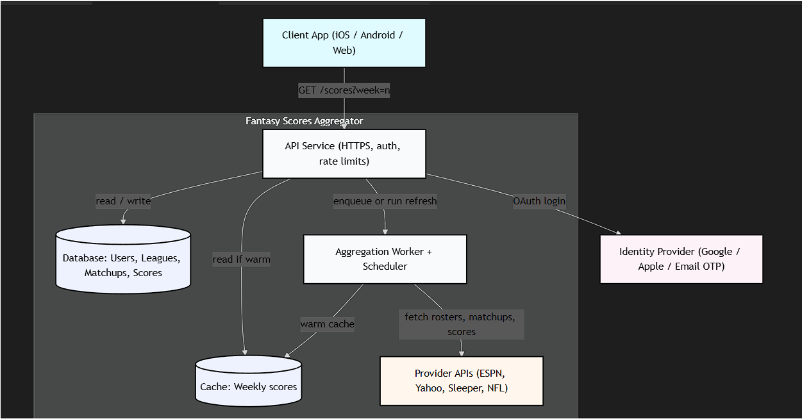
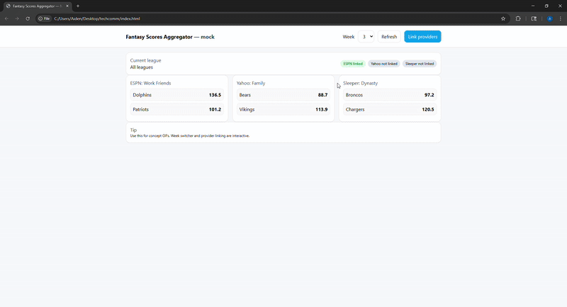

# Fantasy Football Hub

<!-- Banner / Logo (clickable) -->

  

<h1 align="center">Fantasy Scores Aggregator</h1>

  One place to view weekly fantasy matchups and scores across multiple providers.

---

## Table of Contents
- [Overview](#overview)
- [Quickstart](#quickstart)
- [Features](#features)
- [Architecture](#architecture)
- [Usage](#usage)
- [FAQ](#faq)
- [License](#license)

## Overview
**What** — A single view for weekly fantasy matchups and scores across ESPN, Yahoo, Sleeper, and NFL.  
**Who** — Fantasy managers with multiple leagues who want a fast weekly check without opening multiple apps.  
**Why** — Consolidates matchups and scores by week and league to save time.  

> This repo includes a click-through mock UI and concept GIFs to illustrate flows.

## Quickstart
**Open the mock UI**  
1. Download or copy `index.html` into the repo root.  
2. Double-click `index.html` to open in your browser.  

Optional server:
python3 -m http.server 8000
# visit http://localhost:8000

## Features
Week selector — jump between weeks and see matchups refresh.  

Multi-provider linking — link ESPN, Yahoo, Sleeper via OAuth and load leagues.  

League filter — choose an active league to filter the week view.  

Fast reads — cache for hot weekly lookups, worker to refresh provider data.  

## Architecture
Image diagram (click to open)  

## Usage
Week switcher — concept demo  
<video src="gif1.mp4" width="800" controls autoplay loop muted></video>

Link provider account — concept demo  

## FAQ
**Does this support multiple leagues across providers?**  
Yes. Link each provider account and select your active league to filter the view.  

**Is there a full backend right now?**  
No. This repo includes a mock frontend and concept demos to show the flows.  

**How would authentication work in production?**  
Through the identity provider via OAuth (Google, Apple, or email OTP), with encrypted storage of provider tokens.  

**How do I report issues or suggest features?**  
Open a GitHub issue in this repo.  

## License
MIT © 2025
